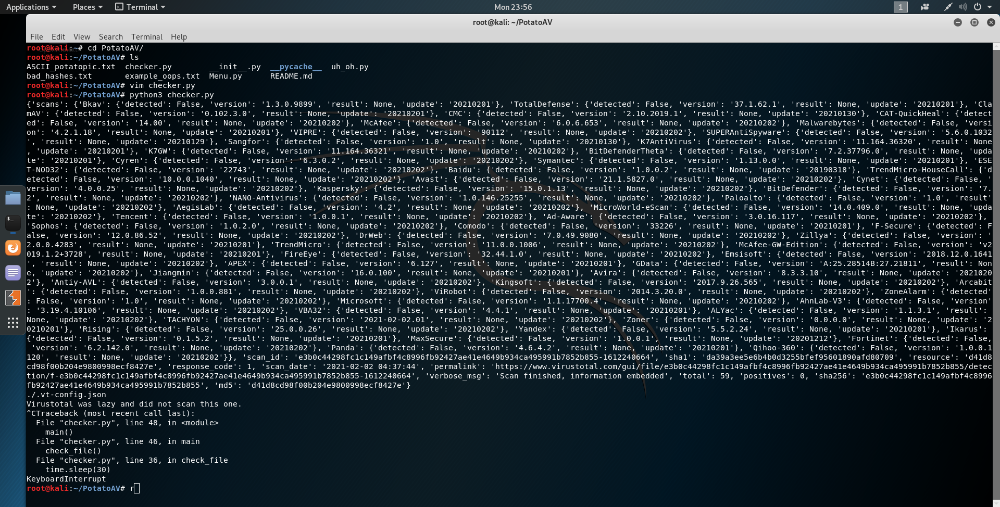
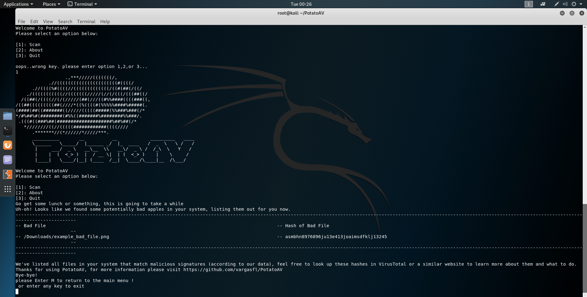

## Welcome to PotatoAV, a student antivirus software!
PotatoAV is an antivirus software that uses VirusTotal's API to scan your system for malicious files.
The program sends a MD5 hash of your file to the API scan, then takes the API's response and cleans it up for you!

#### This is what the API response looks like normally:

#### And this is what it looks like after Potato:

